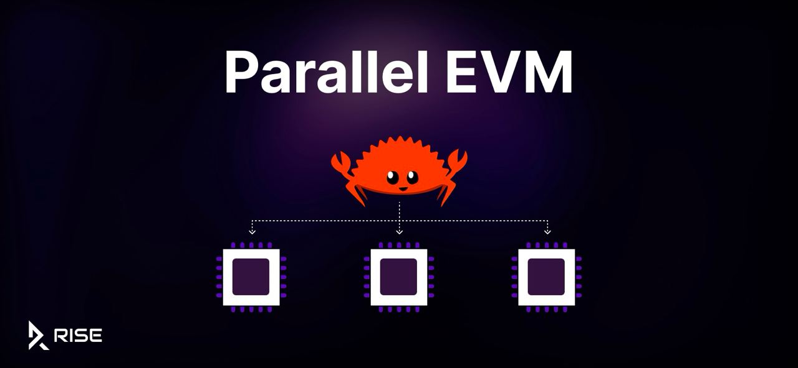

# RISE Parallel EVM


Blazingly fast Parallel EVM in Rust.

:warning: This repository is a **work in progress** and is **not production ready** :construction:



**RISE PEVM** is **a parallel execution engine for EVM chain transactions** heavily inspired by [Block-STM](https://arxiv.org/abs/2203.06871). Since Blockchain transactions are inherently sequential, a parallel execution engine must detect dependencies and avoid conflicts to guarantee the same deterministic outcome with sequential execution. Block-STM optimistically executes transactions and re-executes when conflicts arise using a collaborative scheduler and a multi-version shared data structure. Since it does not require prior knowledge or constraints on the input transactions, **replacing an existing sequential executor with Block-STM is easy for substantial performance boosts**.

Block-STM was initially designed for the Aptos blockchain that runs MoveVM. We must consider several modifications to make it work well with EVM. For instance, all EVM transactions in the same block read and write to the beneficiary account for gas payment, making all transactions interdependent by default. We must carefully monitor reads to this beneficiary account to lazily evaluate it at the end of the block or when an explicit read arises. Polygon has already adapted a version of Block-STM for EVM in their Go node. Our implementation is written in Rust with further optimizations to aim for even higher performance, especially when parallel execution in Go is still slower than sequential execution in Rust!

Finally, while Aptos and Polygon embed their Block-STM implementation directly into their nodes, **this dedicated repository provides both robust versions and a playground for further advancements**. For instance, we can introduce static-analysed metadata from an optimised mempool, support multiple underlying executors, track read checkpoints to re-execute from instead of re-executing the whole transaction upon conflicts and hyper-optimise the implementation at low system levels.

## Goals

- **Become the fastest EVM (block) execution engine** for rapid block building and syncing — **10 Gigagas/s and beyond**.
- Provide deep tests and audits to guarantee safety and support new developments.
- Provide deep benchmarks to showcase improvements and support new developments.
- Complete a robust version for syncing and building blocks for Ethereum, RISE, Optimism, and more EVM chains.
- Get integrated into Ethereum clients and ZK provers like [Reth](https://github.com/paradigmxyz/reth), [Helios](https://github.com/a16z/helios), and [Zeth](https://github.com/risc0/zeth) to help make the Ethereum ecosystem blazingly fast.

## Development

- Install [cmake](https://cmake.org) for building `snmalloc` (highly performant memory allocator).

```sh
$ cargo build
```

### Alpha Done

- Build a Block-STM engine to improve on.
- Complete the first test & benchmark suites.
- Lazily update gas payments to the beneficiary account as implicit reads & writes.
- Preprocess dependencies among transactions with the same sender or recipient or explicitly interact with the beneficiary account.
- Dynamic concurrency level based on preprocessed dependencies.
- Aggressively find tasks to save scheduling cycles.
- Early-existing thread workers to avoid thread overheads and join faster.

### Alpha TODO

- Complete a vital test suite.
- More low-hanging fruit optimizations.
- Robust error handling.
- Better structure, types, and API for integration.
- Benchmark a [Reth](https://github.com/paradigmxyz/reth) integration for syncing and building Ethereum and RISE blocks.

### Beta TODO

- Optimize concurrent data structures to maximize CPU cache and stack memory.
- Optimize the scheduler, thread workers, and synchronization based on common block scenarios.
- More granular memory locations (like breaking `AccountInfo` down into `balance`, `nonce`, and `code`) to avoid false positive dependencies.
- Add pre-provided metadata from a statically analysed mempool or upstream nodes.
- Write custom memory allocators for the whole execution phase and the multi-version data structure. Early experiments with `jemalloc`, `mimalloc`, and `snmalloc` show potential up to 50% improvements. This is understandable when we optimize to the microseconds.
- Track read checkpoints to re-execute from instead of re-executing the whole transaction upon conflicts.
- Support multiple EVM executors (REVM, JIT & AOT compilers, etc.).
- Hyper-optimise at low system levels.
- Propose an EIP to “tax” late dependencies in blocks for validators to put them up front to maximize parallelism.

## Testing

We have three test groups:

- [ethereum/tests](https://github.com/ethereum/tests)'s [general state tests](tests/ethereum/main.rs).
- Mocked blocks: [raw transfers](tests/raw_transfers.rs), [erc20](tests/erc20/main.rs), [uniswap](tests/uniswap/main.rs), [mixed](tests/mixed.rs), [beneficiary](tests/beneficiary.rs), and [small blocks](tests/small_blocks.rs).
- [Ethereum mainnet blocks](tests/mainnet.rs).

```sh
$ git submodule update --init
# Running our heavy tests simutaenously would congest resources.
# Each parallel test still executes parallelly anyway.
$ cargo test --release -- --test-threads=1
```

## Benchmarks

See the dedicated doc [here](./benches/README.md).
